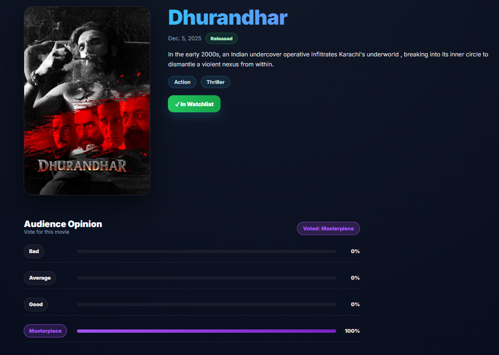
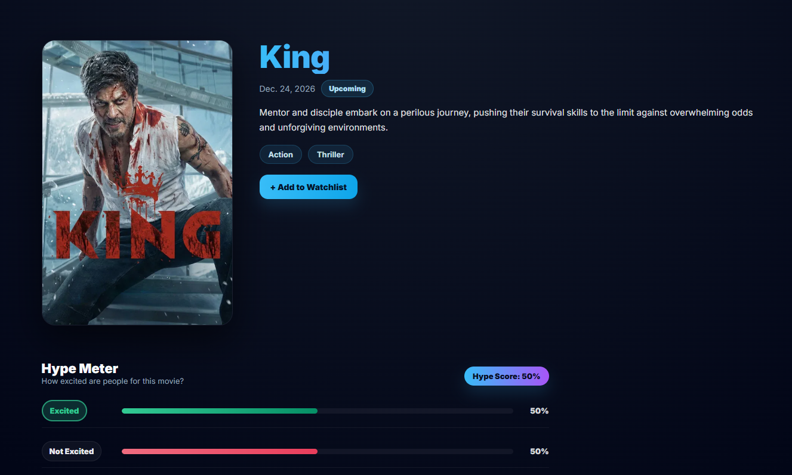
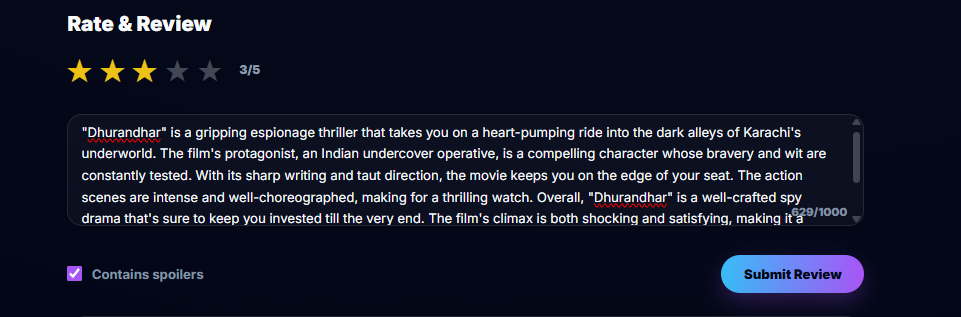
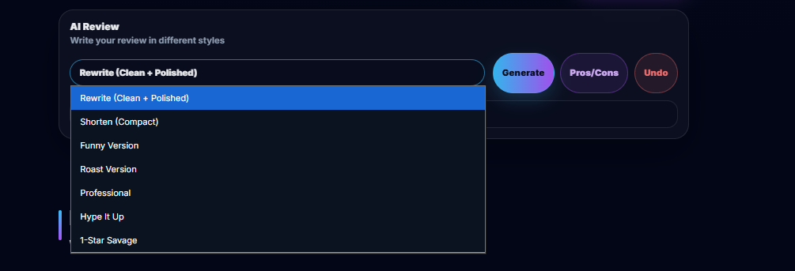

# Movie Opinion Meter

A backend-focused application that aggregates movie opinions through structured voting and reviews. Demonstrates opinion aggregation logic, database constraint design, and API architecture.

**Core Problem:** Traditional ratings collapse complex opinions into a single number. This project separates pre-release hype from post-release reception and captures nuanced sentiment through category-based voting.

**Live:** [movie-opinion-meter.onrender.com](https://movie-opinion-meter.onrender.com/)  
**GitHub:** [SagarDhok/Movie_Opinion_Meter](https://github.com/SagarDhok/Movie_Opinion_Meter)

---


## Screenshots

### Opinion Meter (Released Movies)


### Hype Meter (Upcoming Movies)


### Review System

*Star ratings, spoiler flag, likes, and nested comments*

### AI Review Assistant



---

## Core Backend Concepts Demonstrated

### Opinion Aggregation
- **Two distinct voting systems**: Opinion meter (4 categories) for released movies, Hype meter (binary) for upcoming
- **Database-enforced uniqueness**: `unique_together(user, movie)` prevents duplicate votes
- **Real-time percentage calculation**: Aggregates votes on-read using `COUNT()` and conditional aggregation
- **Vote switching**: `update_or_create()` handles both new votes and changes atomically

### Query Optimization
- `select_related()` for foreign keys (user, movie) → 1 query instead of N+1
- `prefetch_related()` for many-to-many (genres, cast, crew) → 2 queries instead of 1+N
- Database-level aggregation with `annotate(like_count=Count("likes"))` → single query, not Python loops

### Constraint-Driven Design
- Unique constraints enforce "one vote per user per movie" and "one review per user per movie"
- Separate tables for `MovieVote` vs `MovieHypeVote` prevent invalid states (can't hype vote a released movie)
- Cascading deletes maintain referential integrity (delete movie → delete all votes)

### AI Feature Integration
- **Review rewriting** in 7 modes (professional, funny, shorten, roast, etc.)
- **Rate limiting**: 10 requests per 10 minutes per user per action (application-level, logged in `AIRequestLog`)
- **Fallback strategy**: Primary LLM with automatic fallback on failure
- AI is assistive, not core logic → opinion system works without it

---

## Data Modeling Highlights

**Why separate `MovieVote` and `MovieHypeVote` tables?**
- Different vote choices (4 categories vs binary)
- Schema enforces validity (hype votes impossible on released movies)
- Clearer queries (`movie.votes` vs `movie.hype_votes`)
- Avoids invalid states that a single table with flags would allow

**Key Models:**
- `Movie`: TMDB-synced metadata with `is_released` flag controlling logic paths
- `Person`, `Cast`, `Crew`: Normalized modeling of biographies and film credits via TMDB sync
- `MovieVote`: Opinion meter votes (unique per user+movie)
- `MovieHypeVote`: Hype meter votes for unreleased movies (separate table)
- `MovieReview`: Star rating + text + spoiler flag (unique per user+movie)
- `ReviewLike`, `ReviewComment`: Social features with self-referential FK for threading (1 level deep)
- `AIRequestLog`: Audit trail for AI usage (tracks input, output, success, failures)

**Constraints:**
```python
class Meta:
    unique_together = ("user", "movie")  # Enforced at DB level
```

---

## REST API Design

**Public Endpoints:**
```
GET  /api/movies/                    # Filter by genre, status, search
GET  /api/movies/{id}/               # Movie details
GET  /api/movies/{id}/reviews/       # Reviews for movie
```

**Authenticated Endpoints:**
```
POST /api/movies/{id}/review/        # Submit/update review
POST /api/movies/{id}/ai/rewrite/    # AI rewrite (rate-limited)
POST /api/movies/{id}/ai/pros-cons/  # Extract pros/cons (rate-limited)
```

**Traditional Views (Form-based):**
```
POST /movie/{id}/vote/               # Opinion vote submission
POST /movie/{id}/hype/               # Hype vote (upcoming only)
POST /reviews/{id}/like/             # AJAX like/unlike
```

**Why Django REST Framework?**
- Clean serializer pattern separates presentation from models
- Built-in permission classes (`IsAuthenticated`, `AllowAny`)
- Ready for mobile client without rebuilding backend
- Browsable API for testing

---

## Design Decisions & Trade-offs

**Why TMDB API instead of manual movie CRUD?**
- Authoritative data source (no user-entry errors)
- Lets project focus on opinion aggregation, not content management
- Management commands sync data (`python manage.py sync_tmdb_movies`)

**Why no caching layer (Redis)?**
- Vote percentages change on every vote (cache invalidation overhead)
- PostgreSQL aggregations are fast for expected load
- Premature optimization avoided

**Why no admin/moderator roles?**
- No content moderation needed (all content is user-owned)
- Django admin sufficient for data inspection
- Demonstrates focused scope, not feature bloat

**Why this isn't a SaaS?**
- Portfolio project demonstrating backend fundamentals
- No payment processing, user tiers, analytics dashboards
- Intentionally scoped to core concepts

---

## What This Project Proves

**Backend Engineering Skills:**
- Designing normalized schemas with appropriate constraints
- Writing optimized queries (avoiding N+1 problem)
- Implementing business logic in database constraints vs application code
- Separating concerns (views, serializers, services)
- Rate limiting and logging for API features

**Technical Decision-Making:**
- When to use separate tables vs flags (data integrity)
- When to calculate on-read vs cache (data freshness)
- When to use database aggregation vs Python loops (performance)
- Scoping decisions (TMDB integration vs building CMS)


---

## Tech Stack

**Backend:**
- Python 3.11, Django 4.2, Django REST Framework 3.14
- SQL databases (MySQL primary, PostgreSQL basics)

**External Services:**
- TMDB API (movie metadata)
- Groq AI (review rewriting with LLaMA models)
- Supabase (file storage)

**Deployment:**
- Render platform
- Gunicorn (WSGI server)
- WhiteNoise (static files)

---

## Developer Info

**Sagar Dhok**  
Backend Developer | Python | Django | REST APIs

**Links:**
- GitHub: [github.com/SagarDhok](https://github.com/SagarDhok)
- LinkedIn: [linkedin.com/in/sagardhok](https://linkedin.com/in/sagardhok)
- Twitter: [x.com/SagarDh0k](https://x.com/SagarDh0k)
- Email: sdhok041@gmail.com

---

**This project is designed for technical interviews.** It demonstrates backend fundamentals—data modeling, API design, query optimization, constraint usage—without over-engineering. Ready to discuss architecture, scaling decisions, and trade-offs in depth.
